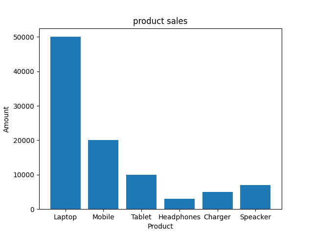

# StatBotPro
AI powered sales data analysis project using python , pandas, Langchain , and Ollama . 
The project analyzes a dataset , generates statistics , visualizes insights , and runs securely using Docker.

## project overview
StatBotPro loads a sales dataset, performs basic analysis, generates visualizations, and provides insights through a simple interface.

## Features 
- Load and analyze dataset using pandas
- Calculate sales statistics
- Identify highest and lowest performing product 
- Generate sales visualization charts
- source code execution using Docker container

## Technologies used
- Python
- pandas
- Matplotlib
- vs code
- streamlit
- Docker
- Ollama/Langchain

## weekly Development Progress

Week 1 – Data Analysis

- Loaded dataset using pandas
- Calculated:
   > Total sales
   > Average sales
   > Highest selling product
   > Lowest selling product

   Week 2 – Visualization
 
- Generated sales bar chart visualization
- Saved charts inside the charts/ folder(sales_chart.png)
- Improved data insights with graphical output

Week 3 – Security & Sandbox

- Implemented secure execution environment.
- Security Features
   > Code execution isolated using Docker
   > only required libraries installed
   > Prevents unauthorized access to host system
- Run using Docker:
docker build -t statbotpro .
docker run statbotpro

Week 4 – Data Interface

- Built a simple Streamlit dashboard.
- Features:
 > Dataset preview
 > Dataset summary
 > Row and column statistics
 > Interactive data visualization
- Run the app:
 > streamlit run app.py

## output
- Total sales
- Average sales
- Highest selling product 
- Lowest selling product
- sales chart visualization

## Screenshot

---------------------------------------------------------------------------------------------